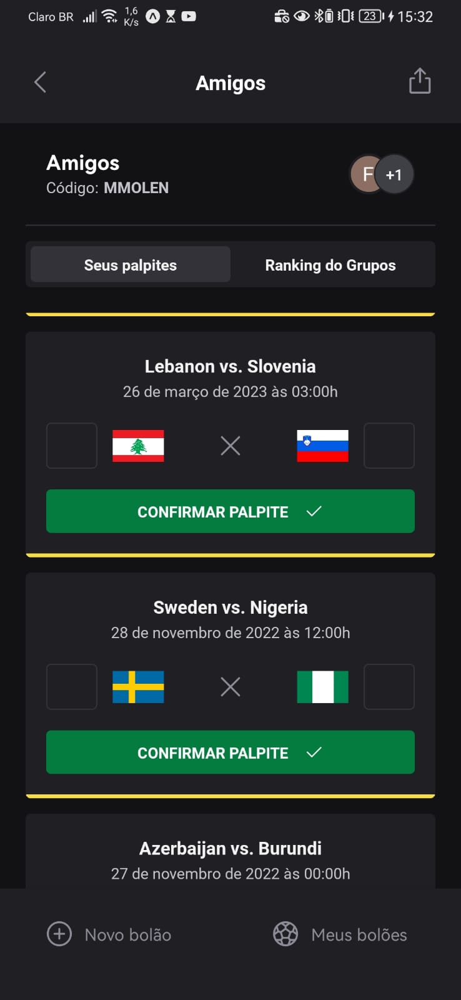
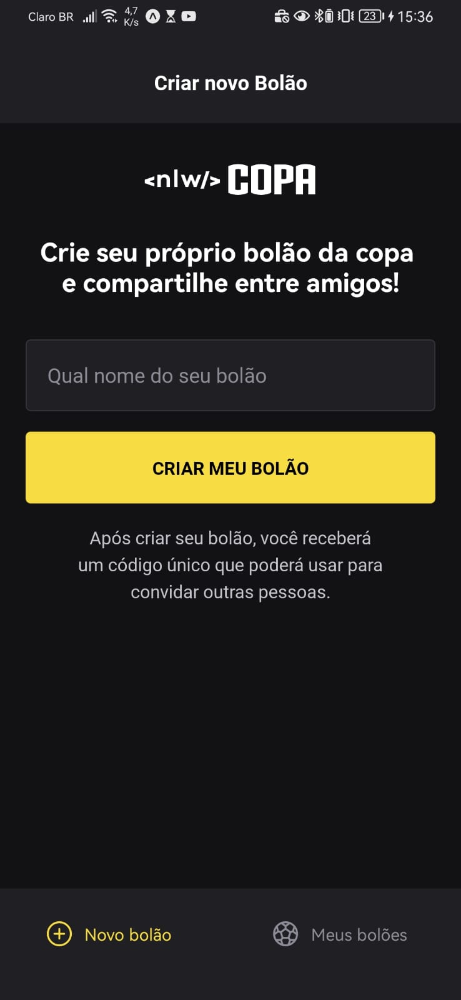
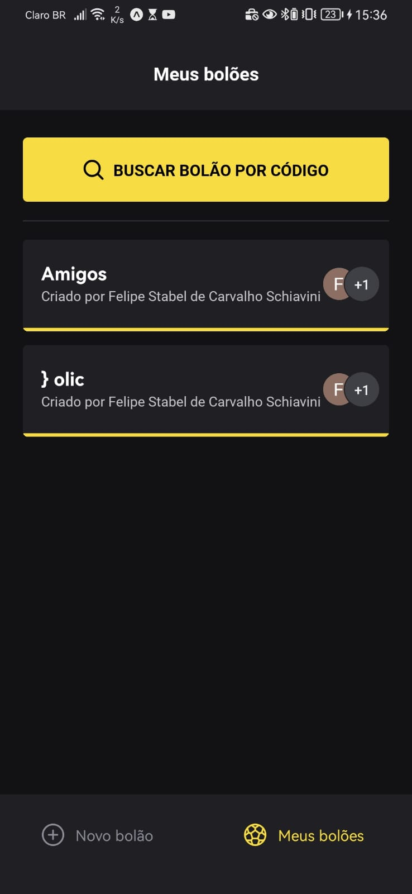

<h1 align="center">Faça sua aposta! Quem irá vencer? ⚽️</h1>

<div align="center">
    
    
    
</div>

<p align="center">
  
  
  
  
  
</p>

<div align="center">
  <a href="#dart-about">About</a> &#xa0; | &#xa0; 
  <a href="#sparkles-features">Features</a> &#xa0; | &#xa0;
  <a href="#rocket-technologies">Technologies</a> &#xa0; | &#xa0;
  <a href="#checkered_flag-starting">Starting</a>
</div>

<br>

## :dart: About ##

This project in React Native is an app to make Polls from country football teams and have fun with your friends.

## :sparkles: Features ##

:heavy_check_mark: Front-end Web;
:heavy_check_mark: Mobile;
:heavy_check_mark: backend;
:heavy_check_mark: Create any Polls;\
:heavy_check_mark: Create Guesses per Poll;\
:heavy_check_mark: Show Ranking per Poll;\
:heavy_check_mark: Share Polls with friends;

## :rocket: Technologies ##

The following tools were used in this project:

- [Node.js](https://nodejs.org/en/)
- [TypeScript](https://www.typescriptlang.org/)
- [React](https://pt-br.reactjs.org/)
- [React Native](https://reactnative.dev/)
- [Expo](https://expo.io/)

## 📚️ Libraries ##

The following some libraries were used in this project:

- [Axios](https://axios-http.com/)
- [fastify](https://www.fastify.io/)
- [React Navigation](https://reactnavigation.org/)
- [Nextjs]()
- [babel]()
- [native-base]()
- [fastify]()
- [prisma]()
- [zod]()


## :checkered_flag: Starting ##
```bash
# Clone this project
$ git clone git@github.com:FelipeSchiavini/world-cup-full-stack.git
```

### Server
```bash
# Access
$ cd server
### run:
$ npm install
### create .env like .env.sample ans set the environment variables 
## the project is using prisma:
### to update migration run
$ npx prisma migrate dev

##You can open and edit database with:
$ npx prisma studio

## To create fake random data:
$ npx prisma db seed

### if you arent testing the aplication with mobile remove:
`host:'0.0.0.0'` on server.ts

###run server
$ npm run dev 
```

### mobile
```bash
# Access
$ cd mobile
### create .env like .env.sample ans set the environment variables 
### you should create google.cloud oath passworld
### run:
$ npm install
###
$ npx expo start

```

### front-end
```bash
# Access
$ cd web
### run:
$ npm install
### make sure that src/lib/axios/lib has correct server baseUrl
### you should run the server listen than run:
$ npm run dev
```

```bash
# Clone this project
$ git clone git@github.com:FelipeSchiavini/world-cup.git
# Access
$ cd mobile_nlwcopa
# Install dependencies
$ yarn
# Run the project with Expo
$ npx expo start
# The expo server will initialize in the exp://localhost:19000
# You can scan the QR code above with Expo Go (Android) or
# the Camera app (iOS)
```

<a href="#top">Back to top</a>